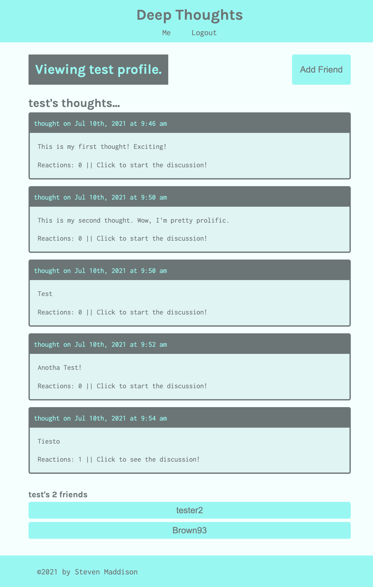

# Deep Throughts

MERN-stack application that allows users to view all thoughts in the system, post their thoughts, react to existing thoughts, and add friends.

The application is deployed to Heroku here: https://cryptic-cove-39070.herokuapp.com/

The following technologies were used in the development of this application:

- Client
  - Apollo Server
  - React
  - React-Router
  - GraphQL
- Server
  - Apollo Server
  - bcrypt
  - Express
  - GraphQL
  - jsonwebtoken
  - Mongoose

## Application Functionality

The application is able to perform the following functions:

- Create user accounts
- Authenticate and allow existing users to log into their accounts
- Allow user (logged-in or not) to:
  - Browse all thoughts posted to the application
  - View all reactions (comments) on thoughts
  - View user profiles showing all thoughts they have posted and their friends in the system
- Allow logged-in users to:
  - Post thoughts
  - Add friends
  - View their personal profile showinf all thoughts they have posted and their friends in the system

## Screenshot

Here is a screenshot of the deployed application, on a user's profile page!

## References

- apollo-server-express: https://www.npmjs.com/package/apollo-server-express
- Apollo: https://www.apollographql.com/docs/
- bcrypt: https://www.npmjs.com/package/bcrypt
- Bootstrap: https://getbootstrap.com/
- Express: https://expressjs.com/
- GraphQL: https://graphql.org/
- jsonwebtoken: https://www.npmjs.com/package/jsonwebtoken
- mongoose: https://mongoosejs.com/
